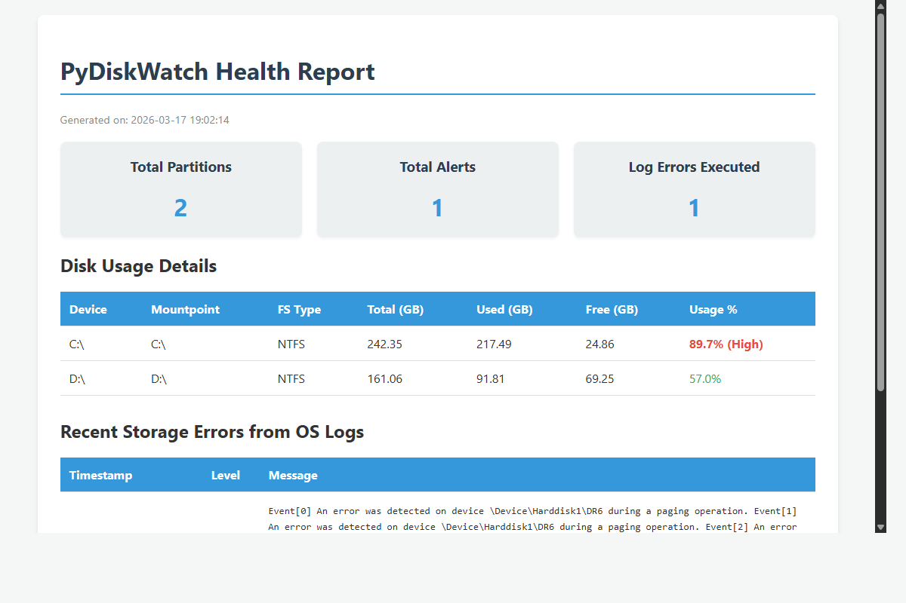

# PyDiskWatch


**PyDiskWatch** is a cross-platform, command-line Python tool that monitors disk health, parses OS-level storage logs for anomalies, generates structured HTML/CSV reports, and fires threshold-based alerts via email or desktop notifications.

Built with a modular, maintainable architecture aligned with robust automation engineering practices.



## Features
- **Disk Monitoring**: Live disk usage, partition metrics, and I/O status using `psutil`, displayed beautifully via `rich`.
- **Log Parsing**: Scrapes `/var/log/syslog` (Linux) or Event Viewer (Windows using `wevtutil`) for storage and disk errors.
- **Reporting**: Generates gorgeous HTML reports and clean CSV data using `Jinja2` templating.
- **Alerting**: Pluggable email (`smtplib`) and desktop notification (`plyer`) alerting based on threshold config.
- **Cross-Platform**: Tested on Windows 10/11 and Linux (Ubuntu/Debian).

## Installation

1. Clone the repository:
```bash
git clone https://github.com/neelzanwar26/pydiskwatch.git
cd pydiskwatch
```

2. Install the package in editable mode:
```bash
pip install -e .
```

All configurations are read from `config.yaml`. Modify thresholds and alert recipients there.

## Usage Commands

### 1. Live Disk Monitoring
Show a live disk usage table.
```bash
pydiskwatch monitor
```

Monitor with a custom 75% threshold and send interactive alerts (if crossed):
```bash
pydiskwatch monitor --threshold 75 --alert
```

### 2. Output HTML & CSV Report
Generate an export summary of your disks to the `./reports` folder:
```bash
pydiskwatch report --out ./reports
```

### 3. Scan System Logs for Errors
Scans system logs for read/write I/O errors and corrupted blocks:
```bash
pydiskwatch log-scan
```

## Running Tests
Tests use `pytest` with extensive mocked dependencies. Run them inside the project:
```bash
pip install -e ".[dev]"
pytest tests/ -v --cov=pydiskwatch --cov-report=term-missing
```

## Contributing
We welcome contributions! Please open an issue before submitting sizable PRs. Adhere to the `pytest` test suite requirements.

## License
MIT License
